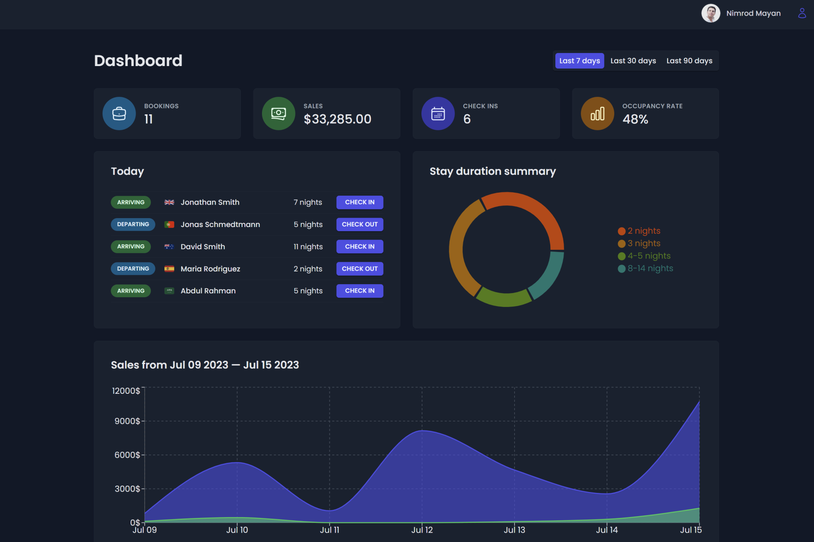

# The Wild Oasis

### A full stack hotel management application. Built with SupaBase, React Query and other React libraries

Live version: https://the-wild-oasis-hotel-manager.netlify.app

Screenshot:



<!-- toc -->

## Table of Contents

- [Features](#features)
- [Usage](#usage)
  - [Application Variables](#application-variables)
  - [Install Dependencies)](#install-dependencies)
  - [Run](#run)
- [Build & Deploy](#build--deploy)
  - [Refresh the Database](#refresh-the-database)
- [Login Credentials](#login-credentials)

<!-- tocstop -->

## Features

- Home screen with key metrics & charts
- Bookings management
- Cabins management
- Users management
- Settings management
- Guest information
- Check in and check out
- Authentication
- Data filtering and sorting
- Dark mode

## Usage

- The application's entire back end (database + API) is hosted on SupaBase
- If you want to set up your own database + API for this application, you can do
  so here - [SupaBase](https://supabase.com)

### Application Variables

In the file `src/utils/constants.js` you will find the following variable:

```
export const PAGE_SIZE = 10;
```

You may change this to any other number, to change the number of items displayed
per page

### Install Dependencies

```
npm install
```

### Run

```
npm run dev
```

## Build & Deploy

```
# Create frontend prod build
npm run build
```

### Refresh the Database

The data in this application is time-sensitive. To refresh the database (in
SupaBase), follow these instructions:

- Open the file: `src/ui/Sidebar.jsx`
- Uncomment the Uploader component (line 23)
- A button will appear on the front end. Click it to refresh the data (this will
  also delete all existing data)
- Comment out the Uploader component

## Login Credentials

```
Sample User Login

nimrod@example.com
123456
```
